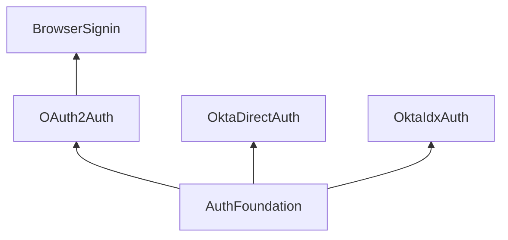

[](https://github.com/okta/okta-mobile-swift/releases/latest)
[](https://swiftpackageindex.com/okta/okta-mobile-swift)
[](https://swiftpackageindex.com/okta/okta-mobile-swift)
[](https://github.com/okta/okta-mobile-swift/actions/workflows/tests.yaml)
[](https://swiftpackageindex.com/okta/okta-mobile-swift)
[](https://cocoapods.org/pods/OktaClient)
[](https://opensource.org/licenses/Apache-2.0)
[][devforum]
[][sdkdocumentation]
[][integrationdocs]

# Okta Client SDK for Swift

[](https://devforum.okta.com/)

The Okta Client SDK represents a collection of SDKs for different languages, each of which itself is a modular ecosystem of libraries that build upon one-another to enable client applications to:

* Authenticate clients with an Authorization Server (AS) using a variety of authentication flows.
* Flexibly store and manage the resulting tokens enabling a wide variety of use-cases.
* Transparently persist and manage the lifecycle of those tokens through authentication, refresh, and revocation.
* Secure applications and tokens, using best practices, by default.

This SDK emphasizes security, developer experience, and customization of the SDK's core capabilities. It is built as a platform, enabling you to choose the individual library components you need for your app.

**Table of Contents**

<!-- TOC depthFrom:2 depthTo:3 -->
<!-- /TOC -->

## Release status

This library uses semantic versioning and follows Okta's [Library Version Policy][okta-library-versioning].

| Version | Status                             |
| ------- | ---------------------------------- |
| 1.8.3   | Retiring                           |
| 2.x     | :heavy_check_mark: Stable ([migration guide][migration-1x]) |

The latest release can always be found on the [releases page][github-releases].

### Version Compatibility

A variety of Swift versions and environments are supported, including:

| Name | Version |
| ---- | ------- |
| [Xcode](#xcode) | 16.0 or later |
| [Swift](#swift) | 5.10, 6.0+ |
| [Swift Toolchain](#swift) | 6.0+ |
| Environments | [Apple](#apple-platforms), [Linux](#linux) _(experimental)_ |

> [!TIP]
> For more information, please see the [SDK support policy details](#support-policy) below.

### Supported Platforms 

All Apple platform targets are supported, with every attempt made to avoid dropping older OS versions unnecessarily.

| Platform    | Minimum Supported | Best-Effort |
| ----------- | ----------------- | ----------- |
| iOS         | 15.0              | 13.0        |
| tvOS        | 15.0              | 13.0        |
| watchOS     | 8.0               | 7.0         |
| visionOS    | 1.0               | 1.0         |
| macCatalyst | 15.0              | 13.0        |
| macOS       | 12.0              | 10.15       |

> [!TIP]
> For more details, please read below on our [approach to Apple Platform version support](#apple-platforms).

## Need help?

If you run into problems using the SDK, you can:

* Review the [SDK documentation][sdkdocumentation] for [AuthFoundation][authfoundation-docs], [OAuth2Auth][oauth2auth-docs], [OktaDirectAuth][oktadirectauth-docs], [OktaIdxAuth][oktaidxauth-docs], and [BrowserSignin][browsersignin-docs]
* Ask questions on the [Okta Developer Forums][devforum]
* Post [issues][github-issues] here on GitHub (for code errors)

## SDK Architecture

This SDK consists of several different libraries, each with detailed documentation.



- [AuthFoundation][authfoundation-docs] -- Common classes for managing credentials and used as a foundation for other libraries.
- [OAuth2Auth][oauth2auth-docs] -- OAuth2 authentication capabilities for advanced use-cases.
- [OktaDirectAuth][oktadirectauth-docs] -- Direct Authentication capabilities for advanced browserless authentication.
- [OktaIdxAuth][oktaidxauth-docs] -- Okta's Identity Engine support using Okta's IDX API for native browserless authentication.
- [BrowserSignin][browsersignin-docs] -- Authenticate users using web-based OIDC flows.

This SDK enables you to build or support a myriad of different authentication flows and approaches.

## Development Roadmap

This SDK is being actively developed, with plans for future expansion. We are always seeking feedback from the developer community to evaluate:

* The overall SDK and its components
* The APIs and overall developer experience
* Use-cases or features that may be missed or do not align with your application’s needs
* Suggestions for future development
* Any other comments or feedback on this new direction.

### Key Features

Several key features and capabilities are introduced with this library, with some notable improvements listed below.

| Feature |
| ------- |
| Simple OIDC web-based sign in |
| Credential management (secure storage, retrieval, etc) |
| Multi-user token handling (store and use tokens for multiple users, scopes, etc) |
| Authorization Code Flow |
| Native SSO / Token Exchange Flow |
| Device Authorization Grant Flow |
| JWT Authorization Grant Flow |
| Resource Owner Flow |
| Okta's DirectAuth Flow |
| Okta's IDX InteractionCode Flow |
| Simplified JWT parsing and handling |
| Streamlined authorization of URLSession requests using credential tokens |
| Many extension points for customizability, monitoring, and tracking |

## Getting Started

To get started, you will need:

* An Okta account, called an _organization_ (sign up for a free [developer organization](https://developer.okta.com/signup) if you need one).
* An Okta Application configured as a "Native App". Use Okta's administrator console to create the application by following the wizard and using default properties.
* Xcode 16.x, targeting one of the supported platforms and target versions (see the [Support Policy][support-policy] below).

For examples of how this SDK can be utilized, please refer to the [sample applications](Samples) included within this repository.

## Install

### Swift Package Manager

Add the following to the `dependencies` attribute defined in your `Package.swift` file. You can select the version using the `majorVersion` and `minor` parameters. For example:

```swift
dependencies: [
    .Package(url: "https://github.com/okta/okta-mobile-swift.git", majorVersion: <majorVersion>, minor: <minor>)
]
```

### CocoaPods

Simply add the following line to your `Podfile`:

```ruby
pod 'OktaBrowserSignin'
```

Then install it into your project:

```bash
pod install --repo-update
```

If you are interested in only consuming the OAuth2Auth library, instead use the following:

```ruby
pod 'OAuth2Auth'
```

If you intend to use the Okta Direct Authentication API, use the following:

```ruby
pod 'OktaDirectAuth'
```

If your application requires advanced integration with Okta's IDX API, use the following:

```ruby
pod 'OktaIdxAuth'
```

## Usage Guide

### Web Authentication using OIDC

The simplest way to integrate authentication in your app is with OIDC through a web browser, using the Authorization Code Flow grant.

#### Configure your OIDC Settings

Before authenticating your user, you need to create your client configuration using the settings defined in your application in the Okta Developer Console. The simplest approach is to use a `Okta.plist` configuration file to specify these settings. Ensure one is created with the following fields:

```xml
<?xml version="1.0" encoding="UTF-8"?>
<!DOCTYPE plist PUBLIC "-//Apple//DTD PLIST 1.0//EN" "http://www.apple.com/DTDs/PropertyList-1.0.dtd">
<plist version="1.0">
  <dict>
    <key>issuer_url</key>
    <string>https://{yourOktaDomain}.com</string>
    <key>client_id</key>
    <string>{clientId}</string>
    <key>redirect_uri</key>
    <string>{redirectUri}</string>
    <key>logout_redirect_uri</key>
    <string>{logoutRedirectUri}</string>
    <key>scope</key>
    <string>openid profile offline_access</string>
  </dict>
</plist>
```

Alternatively, you can supply those values to the constructor the `BrowserSignin` we're about to discuss in the next section.

#### Create a Web Authentication session

Once you've configured your application settings within your `Okta.plist` file, a shared configuration is automatically available through the `BrowserSignin.shared` singleton property. With that in place, you can use the convenience `BrowserSignin.signIn(from:)` method to prompt the user to sign in.

```swift
import BrowserSignin

func signIn() async throws {
    let token = try await BrowserSignin.signIn(from: view.window)
    let credential = try Credential.store(token)
}
```

The `signIn(from:)` function returns a token and, by using the `Credential` class, you can save the token and use it within your application.

### Authentication using Device Code-Flow Grant

For headless devices, or devices that are difficult to use a keyboard (e.g. AppleTV), your application can use OAuth2Auth directly with the `DeviceAuthorizationFlow` class. This will enable you to present a easy to remember code to your user, which they can use on a different device to authorize your application.

Using this is simple:

1. Create an instance of `DeviceAuthorizationFlow`

```swift
let flow = DeviceAuthorizationFlow(
    issuerURL: URL(string: "https://example.okta.com")!,
    clientId: "abc123client",
    scope: "openid offline_access email profile")
```

2. Start an authentication session to receive the code and authorize URL to present to your user.

```swift
let context = try await flow.start()
let code = context.userCode
let uri = context.verificationUri
```

3. Wait for the user to authorize the application from another device.

```swift
let token = try await flow.resume(with: context)
```

### Authentication using Native SSO flow

When using the `device_sso` scope, your application can receive a "device secret", which can be used in combination with your user's ID token to exchange new credentials. To use this within your application, you would use the `TokenExchangeFlow` to exchange those sets of tokens.

```swift
let flow = TokenExchangeFlow(
    issuerURL: URL(string: "https://example.okta.com")!,
    clientId: "abc123client",
    scope: "openid offline_access email profile",
    audience: .default)

let token = try await flow.start(with: [
    .actor(type: .deviceSecret, value: "DeviceToken"),
    .subject(type: .idToken, value: "IDToken")
])
```

### Authentication with Username/Password

For simple authentication use-cases, you can use the `ResourceOwnerFlow` class to authenticate with a plain username and password.

> *NOTE:* The ResourceOwnerFlow class is not recommended since this flow does not support multifactor authentication.  For alternatives to this flow, please see the more comprehensive OktaDirectAuth or OktaIdxAuth libraries.

```swift
let flow = ResourceOwnerFlow(issuerURL: URL(string: "https://example.okta.com")!,
                             clientId: "abc123client",
                             scope: "openid offline_access email profile")
let token = try await flow.start(username: "jane.doe", password: "secretPassword")
```

### Authentication using Direct Authentication

For simple authentication use-cases, you can use the `ResourceOwnerFlow` class to authenticate with a plain username and password.

> **NOTE:** The Okta Direct Authentication library is only available in Swift at this time.

```swift
let flow = DirectAuthenticationFlow(issuerURL: URL(string: "https://example.okta.com")!,
                                    clientId: "abc123client",
                                    scope: "openid offline_access email profile")
switch try await flow.start("jane.doe@example.com", with: .password("secretPassword")) {
    case .success(let token):
        // Store the token
    case .mfaRequired(_):
        // Continue authentication
}
```

For more information, see the [OktaDirectAuth API documentation][oktadirectauth-docs].

### Authentication using the Okta Identity Engine using IDX

For more advanced native authentication use-cases, you can use the `InteractionCodeFlow` class to authenticate using the Okta Identity Engine.

```swift
let flow = try InteractionCodeFlow(issuerURL: URL(string: "https://example.okta.com")!,
                                   clientId: "abc123client",
                                   scope: "openid offline_access email profile",
                                   redirectUri: URL(string: "my.app:/callback"))
```

For more information, see the [OktaIdxAuth API documentation][oktaidxauth-docs].
 
## Storing and using tokens

Once your user has authenticated and you have a `Token` object, your application can store and use those credentials. The most direct approach is to use the `Credential.store(_:tags:security:)` function.

```swift
let credential = try Credential.store(token)
```

As a convenience, the SDK provides a `default` static property on the `Credential` class. This provides a simple way to identify if a user is currently authenticated, and to quickly access that user's credentials. When storing a new credential, if one isn't already stored, it will automatically be assigned as the default.

```swift
if let credential = Credential.default {
    // The user is signed in. Start by refreshing it.
    try await credential.refreshIfNeeded()
}
```

### Finding credentials by their unique identifier

When a token is stored, it is assigned a unique ID, which can be used to differentiate between tokens and to retrieve a token at a later date.

```swift
let tokenId = token.id

// Later, retrieve the token
if let credential = try Credential.with(id: tokenId) {
    // Use the credential
}
```

### Assigning and finding credentials using custom tags

For more complex applications, you may need to manage multiple credentials (e.g. multi-user sign-in, different tokens for app extensions, granular scopes for different portions of your application, etc). To make it easier to differentiate between credentials, you can assign tags to them which can later be used to identify them.

```swift
try Credential.store(token, tags: ["customTag": "someValue"])
```

The credential can later be retrieved based on these tags.

```swift
if let credential = try Credential.find(where: { $0.tags["customTag"] == "someValue" }).first {
    // Use the credential
}
```

A credential's tags are available through its `tags` property, and can be changed after the fact.

```
if !credential.tags.contains("someCustomTag") {
    credential.tags["someCustomTag"] = "someValue"
}

// Or use the following method to intercept exceptions
try credential.setTags(["customTag": "someValue"])
```

### Finding credentials using ID token claims

This SDK simplifies access to JWT tokens and their claims. In fact, a Token's `idToken` property is automatically exposed as an instance of `JWT`. Using this, you can enumerate and retrieve credentials based on the claims associated with their tokens.

```swift
if let credential = try Credential.find(where: { $0.email == "user@example.com" }).first {
    // Use the credential
}
```

### Authorizing outgoing requests to a Resource Server (RS)

While the traditional approach of manually adding the `access_token` value to an HTTP header is supported, the Credential class provides conveniences that drastically improves your developer experience when working with the Authorization header.

The recommended approach to is to use the `authorize(_:)` function, which accepts a URLRequest object and adds the appropriate headers to the request's HTTP headers with the appropriate token information. The are two versions of the same function:

1. A synchronous function that simply adds the access token header to the request.
2. An `async` function that ensures the token has not expired, and proactively refreshes the token on your behalf before adding the headers to the request.

For example:

```swift
// Retrieve the credentials for the user
guard let credential = Credential.default else { return }

// Create the API request
var request = URLRequest(url: URL(string: "https://api.example.com/some/path")!)
request.method = "POST"

// Authorize the request with the user's credentials. The request is
// passed as a pointer so it is updated in-place.
try await credential.authorize(&request)

// Send the request, retrieving the results.
let (data, response) = try await URLSession.shared.data(for: request)
```

### Rate Limit Handling

The Okta API will return 429 responses if too many requests are made within a given time. Please see [Rate Limiting at Okta](https://developer.okta.com/docs/api/getting_started/rate-limits) for a complete
list of which endpoints are rate limited. This SDK automatically retries requests on 429 errors. The default configuration is as follows:

| Configuration Option | Description |
| ---------------------- | -------------- |
| maximumCount         | The number of times to retry. The default value is `3`. |

#### Customizing Rate Limit 

To customize how rate limit is handled, conform to the `APIClientDelegate` protocol, implement the `shouldRetry(request:rateLimit:)` method, and add your class as a delegate for the appropriate client. When any request sent through that client receives an HTTP 429 error response, it will allow you to customize the rate limit behavior.

```swift
import AuthFoundation

func login() {
    // Configure your authentication flow, before running the following command
    flow.client.add(delegate: self)
}

extension OAuth2Client {
    public func api(client: APIClient, shouldRetry request: URLRequest) -> APIRetry {
        return .doNotRetry
    }
}
```

For more information, refer to the API documentation for the `APIRetry` enumeration.

## Migration from legacy SDKs

This collection of SDKs intend to replace the following SDKs:

* [okta-oidc-ios](https://github.com/okta/okta-oidc-ios)
* [okta-ios-jwt](https://github.com/okta/okta-ios-jwt)
* [okta-storage-swift](https://github.com/okta/okta-storage-swift)

If your application currently uses OktaOidc, facilities are in place to migrate your existing users to the new SDK. For more information, see the `SDKVersion.Migration` class for details.

## Running the Samples

Several applications are available to demonstrate different workflows of this SDK. For more information, please see the [sample applications](Samples).

## Support Policy

This policy defines the extent of the support for Xcode, Swift, and platform (iOS, macOS, tvOS, and watchOS) versions.

### Xcode

Xcode 16 or later, as these are the [minimum requirements for submission to the Apple App Store][apple-app-store-requirements].

We support only Xcode versions that are currently accepted for submissions to the Apple App Store. Once a version of Xcode is no longer supported for App Store submissions, dropping support for it will not be considered a breaking change and may be done in a minor release.

### Swift

This library is designed for Swift 6 and above, with compatibility for Swift 5.10, though this requires the use of the Swift 6 Toolchain. The minimum supported Swift version is 5.10, which is the version shipped with the oldest-supported Xcode version. Once a Swift 5 minor becomes unsupported, dropping support for it will not be considered a breaking change, and will be done in a minor release.

This library supports Swift 6, with full support for Strict Concurrency.

### Environments

Though the primary target for this SDK is Apple and its various platforms, other deployment environments are supported in either a limited or experimental capacity.

#### Apple Platforms

Only the last 4 major platform versions are officially supported, unless there are platform limitations that limit our ability to support older versions.

Once a platform version becomes unsupported, dropping support for it will not be considered a breaking change and will be done in a minor release. For example, iOS 15 will cease to be supported when iOS 19 is released, and might be dropped in a minor release in the future.

In the case of macOS, the yearly named releases are considered a major platform version for this Policy, regardless of the actual version numbers.

> *Note:* Older OS versions are supported in a best-effort manner. Unless there are API limitations that prevent the SDK from working effectively on older OS versions, the minimum requirements will not be changed.

#### Linux

This SDK is tested with Ubuntu 24.04 to ensure compatibility with Linux environments, though it's important to note that only Swift 6.0 and above is supported there.

> [!CAUTION]
> Linux support is experimental. Compatibility with Linux considered is best-effort and is not officially supported at this time. Every effort is taken to ensure its continued compatibility, and Continuous Integration tests are used to assert that all tests pass before updates are merged.

Some features are not yet supported in Linux, including but not limited to:

| Feature | Comments |
| ------- | -------- |
| Keychain Token Storage | The UserDefaults token storage mechanism is supported, but encryption / security at rest is not implemented yet. |
| Browser Authentication | The BrowserSignin library only targets Apple platforms, and is unavailable in Linux |
| JWT Validation | The Linux-compatible crypto libraries have not yet been integrated into JWT validation |
| PKCE | PKCE key and signature generation has not been implemented in Linux yet |

### Legacy SDK version support

The okta-oidc-ios SDK is considered legacy, and all new feature development is made to okta-mobile-swift.  The legacy SDKs only receive critical bug and security fixes, so it's advisable for developers to migrate to this new SDK.

## Development

### Protecting Test Configuration

This repository contains two files within `Samples/Shared` which are used to expose test credentials to automated tests as well as the sample applications.

* [Okta.plist](Samples/Shared/Okta.plist)
* [TestConfiguration.xcconfig](Samples/Shared/TestConfiguration.xcconfig)

To protect against accidental changes being introduced to these files, it is recommended that you use the following command after cloning this repository:

```bash
git config core.hooksPath ./.githooks
```

This will run checks before committing changes to ensure these files are not altered.

### Running Tests

Tests can be run on macOS from the command-line using:

```bash
swift test
```

Alternatively, if you wish to run tests within Linux, you can utilize Docker from a macOS environment to run Linux tests:

```bash
docker run --rm --privileged --interactive --tty \
    --volume "$(pwd):/src" --workdir "/src" swift:latest \
    swift test
```

## Known issues

## Contributing

We are happy to accept contributions and PRs! Please see the [contribution guide](CONTRIBUTING.md) to understand how to structure a contribution.

[devforum]: https://devforum.okta.com/
[integrationdocs]: https://developer.okta.com/docs/guides/sign-into-mobile-app-redirect/ios/main/
[lang-landing]: https://developer.okta.com/code/swift/
[github-issues]: https://github.com/okta/okta-mobile-swift/issues
[github-releases]: https://github.com/okta/okta-mobile-swift/releases
[sdkdocumentation]: https://okta.github.io/okta-mobile-swift/development/documentation/
[authfoundation-docs]: https://okta.github.io/okta-mobile-swift/development/documentation/authfoundation/
[oktadirectauth-docs]: https://okta.github.io/okta-mobile-swift/development/documentation/oktadirectauth/
[oktaidxauth-docs]: https://okta.github.io/okta-mobile-swift/development/documentation/oktaidxauth/
[oauth2auth-docs]: https://okta.github.io/okta-mobile-swift/development/documentation/oauth2auth/
[browsersignin-docs]: https://okta.github.io/okta-mobile-swift/development/documentation/browsersignin/
[Rate Limiting at Okta]: https://developer.okta.com/docs/api/getting_started/rate-limits
[okta-library-versioning]: https://developer.okta.com/code/library-versions
[support-policy]: #support-policy
[migration-1x]: MIGRATION.md#migrating-from-okta-client-sdk-1x
[apple-app-store-requirements]: https://developer.apple.com/news/upcoming-requirements/?id=02212025a
