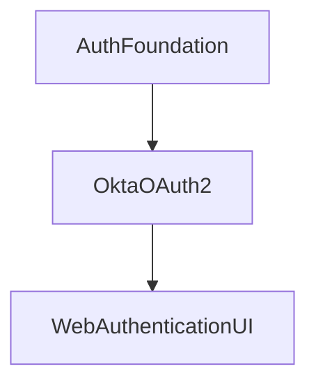

[](https://devforum.okta.com/)

[][devforum]
[][swiftdocs]

# Okta Mobile SDK for Swift

The Okta Mobile SDK represents a suite of libraries that intends to replace our legacy mobile SDKs, with the aim to streamline development, ease maintenance and feature expansion, and enable new use cases that were previously difficult or impractical to implement. We are building a platform to support the development of many SDKs, allowing application developers to choose which components they need.

**Table of Contents**

<!-- TOC depthFrom:2 depthTo:3 -->
<!-- /TOC -->

## Release status

This library uses semantic versioning and follows Okta's [Library Version Policy][okta-library-versioning].

| Version | Status                             |
| ------- | ---------------------------------- |
| 0.1.0   | ✔️ Beta                             |

The latest release can always be found on the [releases page][github-releases].

## Need help?

If you run into problems using the SDK, you can:

* Ask questions on the [Okta Developer Forums][devforum]
* Post [issues][github-issues] here on GitHub (for code errors)

## SDK Architecture

This SDK consists of several different libraries, each with detailed documentation.



- AuthFoundation -- Common classes for managing credentials and used as a foundation for other libraries.
- OktaOAuth2 -- OAuth2 authentication capabilities for authenticating users.
- WebAuthenticationUI -- Authenticate users using web-based OIDC flows.

This SDK enables you to build or support a myriad of different authentication flows and approaches.

## Development Roadmap

This SDK is being actively developed and is in Beta release status. At this time, we are seeking feedback from the developer community to evaluate:

* The overall SDK and its components;
* The APIs and overall developer experience;
* Use-cases or features that may be missed or do not align with your application’s needs;
* Suggestions for future development;
* Any other comments or feedback on this new direction.

### Feature roadmap

| Feature | Status |
| ------- | ------ |
| Login and logout via web redirect | ✅ |
| Credential management | ✅ |
| Secure token storage | ✅ |
| Native SSO / Token Exchange Flow | ✅ |
| Device Authorization Grant Flow | ✅ |
| Resource Owner Flow | ✅ |
| Automatically authorized URLSessionConfiguration for authorizing requests | ✅ |
| Time synchronization via NTP | 🚧 |
| Advanced logging and tracing | 🚧 |
| Transparent upgrades from okta-oidc-ios | 🚧 |

## Getting Started

To get started, you will need:

* An Okta account, called an _organization_ (sign up for a free [developer organization](https://developer.okta.com/signup) if you need one).
* An Okta Application configured as a Native App. Use Okta's administrator console to create the application by following the wizard and using default properties.
* Xcode 13.x, targeting one of the supported platforms and target versions (see the [Support Policy][support-policy] below).

For examples of how this SDK can be utilized, please refer to the [sample applications](Samples) included within this repository.

## Install

### Swift Package Manager

Add the following to the `dependencies` attribute defined in your `Package.swift` file. You can select the version using the `majorVersion` and `minor` parameters. For example:

```swift
dependencies: [
    .Package(url: "https://github.com/okta/okta-mobile-swift.git", majorVersion: <majorVersion>, minor: <minor>)
]
```

### CocoaPods

The SDK will support CocoaPods as it nears its full release.

### Carthage

To integrate this SDK into your Xcode project using [Carthage](https://github.com/Carthage/Carthage), specify it in your Cartfile:
```ruby
github "okta/okta-mobile-swift"
```

Then install it into your project:

`carthage update --use-xcframeworks`

**Note:** Make sure Carthage version is 0.37.0 or higher. Otherwise, Carthage can fail.

## Usage Guide

### Web Authentication using OIDC

The simplest way to integrate authentication in your app is with OIDC through a web browser, using the Authorization Code Flow grant.

#### Configure your OIDC Settings

Before authenticating your user, you need to create your client configuration using the settings defined in your application in the Okta Developer Console. The simplest approach is to use a `Okta.plist` configuration file to specify these settings. Ensure one is created with the following fields:

```xml
<?xml version="1.0" encoding="UTF-8"?>
<!DOCTYPE plist PUBLIC "-//Apple//DTD PLIST 1.0//EN" "http://www.apple.com/DTDs/PropertyList-1.0.dtd">
<plist version="1.0">
  <dict>
    <key>issuer</key>
    <string>https://{yourOktaDomain}.com</string>
    <key>clientId</key>
    <string>{clientId}</string>
    <key>redirectUri</key>
    <string>{redirectUri}</string>
    <key>logoutRedirectUri</key>
    <string>{logoutRedirectUri}</string>
    <key>scopes</key>
    <string>openid profile offline_access</string>
  </dict>
</plist>
```

Alternatively, you can supply those values to the constructor the `WebAuthentication` we're about to discuss in the next section.

#### Create a Web Authentication session

Once you've configured your application settings within your `Okta.plist` file, a shared configuration is automatically available through the `WebAuthentication.shared` singleton property. With that in place, you can use the convenience `WebAuthentication.signIn(from:)` method to prompt the user to sign in.

```swift
import WebAuthenticationUI

func signIn() async {
    let token = try await WebAuthentication.signIn(from: view.window)
    let credential = try Credential.store(token)
}
```

The `signIn(from:)` function returns a token and, by using the `Credential` class, you can save the token and use it within your application.

### Authentication using Device Code-Flow Grant

For headless devices, or devices that are difficult to use a keyboard (e.g. AppleTV), your application can use OktaOAuth2 directly with the `DeviceAuthorizationFlow` class. This will enable you to present a easy to remember code to your user, which they can use on a different device to authorize your application.

Using this is simple:

1. Create an instance of `DeviceAuthorizationFlow`

```swift
let flow = DeviceAuthorizationFlow(
    issuer: URL(string: "https://example.okta.com")!,
    clientId: "abc123client",
    scopes: "openid offline_access email profile")
```

2. Start an authentication session to receive the code and authorize URL to present to your user.

```swift
let context = try await flow.resume()
let code = context.userCode
let uri = context.verificationUri
```

3. Wait for the user to authorize the application from another device.

```swift
let token = try await flow.resume(with: context)
```

### Authentication using Native SSO flow

When using the `device_sso` scope, your application can receive a "device secret", which can be used in combination with your user's ID token to exchange new credentials. To use this within your application, you would use the `TokenExchangeFlow` to exchange those sets of tokens.

```swift
let flow = TokenExchangeFlow(
    issuer: URL(string: "https://example.okta.com")!,
    clientId: "abc123client",
    scopes: "openid offline_access email profile",
    audience: .default)

let token = try await flow.resume(with: [
    .actor(type: .deviceSecret, value: "DeviceToken"),
    .subject(type: .idToken, value: "IDToken")
])
```

### Authentication with Username/Password

For simple authentication use-cases, you can use the `ResourceOwnerFlow` class to authenticate with a plain username and password.

```swift
let flow = ResourceOwnerFlow(issuer: URL(string: "https://example.okta.com")!,
                             clientId: "abc123client",
                             scopes: "openid offline_access email profile")
let token = try await flow.resume(username: "jane.doe", password: "secretPassword")
```

## Support Policy

This policy defines the extent of the support for Xcode, Swift, and platform (iOS, macOS, tvOS, and watchOS) versions.

### Xcode

The only supported versions of Xcode are those that can be currently used to submit apps to the App Store. Once a Xcode version becomes unsupported, dropping support for it will not be considered a breaking change, and will be done in a minor release.

### Swift

The minimum supported Swift 5 minor version is the one released with the oldest-supported Xcode version. Once a Swift 5 minor becomes unsupported, dropping support for it will not be considered a breaking change, and will be done in a minor release.

### Platforms

Only the last 4 major platform versions are officially supported, starting from:

- iOS 12
- macOS 10.15
- Catalyst 13
- tvOS 12
- watchOS 6.2

Once a platform version becomes unsupported, dropping support for it will not be considered a breaking change and will be done in a minor release. For example, iOS 12 will cease to be supported when iOS 16 gets released, and might be dropped in a minor release.

In the case of macOS, the yearly named releases are considered a major platform version for this Policy, regardless of the actual version numbers.

> *Note:* Older OS versions are supported in a best-effort manner. Unless there are API limitations that prevent the SDK from working effectively on older OS versions, the minimum requirements will not be changed.
> 
> Additionally, Linux compatibility is considered best-effort and is not officially supported.

### Legacy SDK support

After the okta-mobile-swift SDK becomes generally available, we intend all new feature development to proceed within this new library. We plan to support okta-oidc-ios (and our other legacy SDKs that okta-mobile-swift replaces) with critical bug and security fixes for the foreseeable future. 

## Development

### Running Tests

Tests can be run on macOS from the command-line using:

```
swift test
```

Alternatively, if you wish to run tests within Linux, you can utilize Docker from a macOS environment to run Linux tests:

```
docker run --rm --privileged --interactive --tty \
    --volume "$(pwd):/src" --workdir "/src" swift:5.5 \
    swift test
```

## Known issues

## Contributing

We are happy to accept contributions and PRs! Please see the [contribution guide](CONTRIBUTING.md) to understand how to structure a contribution.

[devforum]: https://devforum.okta.com/
[swiftdocs]: https://developer.okta.com/okta-mobile-swift/latest/
[lang-landing]: https://developer.okta.com/code/swift/
[github-issues]: https://github.com/okta/okta-mobile-swift/issues
[github-releases]: https://github.com/okta/okta-mobile-swift/releases
[Rate Limiting at Okta]: https://developer.okta.com/docs/api/getting_started/rate-limits
[okta-library-versioning]: https://developer.okta.com/code/library-versions
[support-policy]: #support-policy
