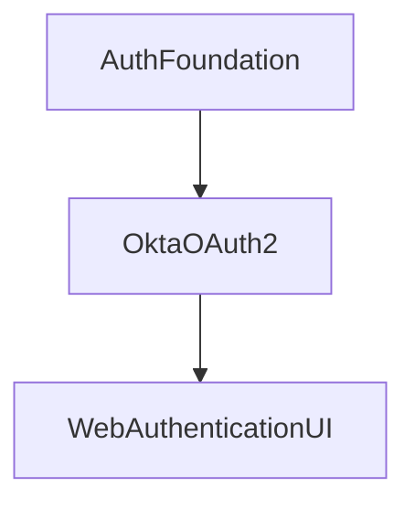

[](https://devforum.okta.com/)
[](https://opensource.org/licenses/Apache-2.0)
[][devforum]
[][swiftdocs]


# Okta Mobile SDK for Swift

The Okta Mobile SDK replaces our legacy mobile SDKs (such as okta-oidc-ios) and enables:

* Streamlined development
* Increased maintainability of the Okta portion of your code
* Easier feature expansion
* Support for use cases that were previously difficult or impractical to implement.

This new SDK is built as a platform, enabling you to choose the components you need for your app.

**Table of Contents**

<!-- TOC depthFrom:2 depthTo:3 -->
<!-- /TOC -->

## Release status

This library uses semantic versioning and follows Okta's [Library Version Policy][okta-library-versioning].

| Version | Status                             |
| ------- | ---------------------------------- |
| 1.7.1   | ✔️ Stable                             |

The latest release can always be found on the [releases page][github-releases].

## Need help?

If you run into problems using the SDK, you can:

* Review the API documentation for [AuthFoundation][authfoundation-docs], [OktaOAuth2][oktaoauth2-docs], and [WebAuthenticationUI][webauthenticationui-docs]
* Ask questions on the [Okta Developer Forums][devforum]
* Post [issues][github-issues] here on GitHub (for code errors)

## SDK Architecture

This SDK consists of several different libraries, each with detailed documentation.



- [AuthFoundation][authfoundation-docs] -- Common classes for managing credentials and used as a foundation for other libraries.
- [OktaDirectAuth][oktadirectauth-docs] -- Direct Authentication capabilities for advanced browserless authentication (EA).
- [OktaOAuth2][oktaoauth2-docs] -- OAuth2 authentication capabilities for advanced use-cases.
- [WebAuthenticationUI][webauthenticationui-docs] -- Authenticate users using web-based OIDC flows.

This SDK enables you to build or support a myriad of different authentication flows and approaches.

## Development Roadmap

This SDK is being actively developed, with plans for future expansion. At this time, we are seeking feedback from the developer community to evaluate:

* The overall SDK and its components
* The APIs and overall developer experience
* Use-cases or features that may be missed or do not align with your application’s needs
* Suggestions for future development
* Any other comments or feedback on this new direction.

### Key Features

Several key features and capabilities are introduced with this library, with some notable improvements listed below.

| Feature |
| ------- |
| Simple OIDC web-based sign in |
| Credential management (secure storage, retrieval, etc) |
| Multi-token handling (store and use tokens for multiple users, scopes, etc) |
| Authorization Code Flow |
| Native SSO / Token Exchange Flow |
| Device Authorization Grant Flow |
| Resource Owner Flow |
| Simplified JWT parsing and handling |
| Streamlined authorization of URLSession requests using credential tokens |
| Many extension points for customizability, monitoring, and tracking |

## Getting Started

To get started, you will need:

* An Okta account, called an _organization_ (sign up for a free [developer organization](https://developer.okta.com/signup) if you need one).
* An Okta Application configured as a "Native App". Use Okta's administrator console to create the application by following the wizard and using default properties.
* Xcode 13.x, targeting one of the supported platforms and target versions (see the [Support Policy][support-policy] below).

For examples of how this SDK can be utilized, please refer to the [sample applications](Samples) included within this repository.

## Install

### Swift Package Manager

Add the following to the `dependencies` attribute defined in your `Package.swift` file. You can select the version using the `majorVersion` and `minor` parameters. For example:

```swift
dependencies: [
    .Package(url: "https://github.com/okta/okta-mobile-swift.git", majorVersion: <majorVersion>, minor: <minor>)
]
```

### CocoaPods

Simply add the following line to your `Podfile`:

```ruby
pod 'OktaWebAuthenticationUI'
```

Then install it into your project:

```bash
pod install --repo-update
```

If you are interested in only consuming the OktaOAuth2 library, instead use the following:

```ruby
pod 'OktaOAuth2'
```

If you are participating in the Early Access preview of the Okta Direct Authentication API, use the following:

```ruby
pod 'OktaDirectAuth'
```

## Usage Guide

### Web Authentication using OIDC

The simplest way to integrate authentication in your app is with OIDC through a web browser, using the Authorization Code Flow grant.

#### Configure your OIDC Settings

Before authenticating your user, you need to create your client configuration using the settings defined in your application in the Okta Developer Console. The simplest approach is to use a `Okta.plist` configuration file to specify these settings. Ensure one is created with the following fields:

```xml
<?xml version="1.0" encoding="UTF-8"?>
<!DOCTYPE plist PUBLIC "-//Apple//DTD PLIST 1.0//EN" "http://www.apple.com/DTDs/PropertyList-1.0.dtd">
<plist version="1.0">
  <dict>
    <key>issuer</key>
    <string>https://{yourOktaDomain}.com</string>
    <key>clientId</key>
    <string>{clientId}</string>
    <key>redirectUri</key>
    <string>{redirectUri}</string>
    <key>logoutRedirectUri</key>
    <string>{logoutRedirectUri}</string>
    <key>scopes</key>
    <string>openid profile offline_access</string>
  </dict>
</plist>
```

Alternatively, you can supply those values to the constructor the `WebAuthentication` we're about to discuss in the next section.

#### Create a Web Authentication session

Once you've configured your application settings within your `Okta.plist` file, a shared configuration is automatically available through the `WebAuthentication.shared` singleton property. With that in place, you can use the convenience `WebAuthentication.signIn(from:)` method to prompt the user to sign in.

```swift
import WebAuthenticationUI

func signIn() async {
    let token = try await WebAuthentication.signIn(from: view.window)
    let credential = try Credential.store(token)
}
```

The `signIn(from:)` function returns a token and, by using the `Credential` class, you can save the token and use it within your application.

### Authentication using Device Code-Flow Grant

For headless devices, or devices that are difficult to use a keyboard (e.g. AppleTV), your application can use OktaOAuth2 directly with the `DeviceAuthorizationFlow` class. This will enable you to present a easy to remember code to your user, which they can use on a different device to authorize your application.

Using this is simple:

1. Create an instance of `DeviceAuthorizationFlow`

```swift
let flow = DeviceAuthorizationFlow(
    issuer: URL(string: "https://example.okta.com")!,
    clientId: "abc123client",
    scopes: "openid offline_access email profile")
```

2. Start an authentication session to receive the code and authorize URL to present to your user.

```swift
let context = try await flow.start()
let code = context.userCode
let uri = context.verificationUri
```

3. Wait for the user to authorize the application from another device.

```swift
let token = try await flow.resume(with: context)
```

### Authentication using Native SSO flow

When using the `device_sso` scope, your application can receive a "device secret", which can be used in combination with your user's ID token to exchange new credentials. To use this within your application, you would use the `TokenExchangeFlow` to exchange those sets of tokens.

```swift
let flow = TokenExchangeFlow(
    issuer: URL(string: "https://example.okta.com")!,
    clientId: "abc123client",
    scopes: "openid offline_access email profile",
    audience: .default)

let token = try await flow.start(with: [
    .actor(type: .deviceSecret, value: "DeviceToken"),
    .subject(type: .idToken, value: "IDToken")
])
```

### Authentication with Username/Password

For simple authentication use-cases, you can use the `ResourceOwnerFlow` class to authenticate with a plain username and password.

> *NOTE:* The ResourceOwnerFlow class has been marked as deprecated, since its functionality is being replaced with the more comprehensive OktaDirectAuth library.

```swift
let flow = ResourceOwnerFlow(issuer: URL(string: "https://example.okta.com")!,
                             clientId: "abc123client",
                             scopes: "openid offline_access email profile")
let token = try await flow.start(username: "jane.doe", password: "secretPassword")
```

### Authentication using Direct Authentication (EA)

For simple authentication use-cases, you can use the `ResourceOwnerFlow` class to authenticate with a plain username and password.

> **NOTE:** The Okta Direct Authentication API is currently marked as Early Access (EA) and is not generally available yet.

```swift
let flow = DirectAuthenticationFlow(issuer: URL(string: "https://example.okta.com")!,
                                    clientId: "abc123client",
                                    scopes: "openid offline_access email profile")
switch try await flow.start("jane.doe@example.com", with: .password("secretPassword")) {
    case .success(let token):
        // Store the token
    case .mfaRequired(_):
        // Continue authentication
}
```

For more information, see the [OktaDirectAuth API documentation][oktadirectauth-docs].

## Storing and using tokens

Once your user has authenticated and you have a `Token` object, your application can store and use those credentials. The most direct approach is to use the `Credential.store(_:tags:security:)` function.

```swift
let credential = try Credential.store(token)
```

As a convenience, the SDK provides a `default` static property on the `Credential` class. This provides a simple way to identify if a user is currently authenticated, and to quickly access that user's credentials. When storing a new credential, if one isn't already stored, it will automatically be assigned as the default.

```swift
if let credential = Credential.default {
    // The user is signed in. Start by refreshing it.
    try await credential.refreshIfNeeded()
}
```

### Finding credentials by their unique identifier

When a token is stored, it is assigned a unique ID, which can be used to differentiate between tokens and to retrieve a token at a later date.

```swift
let tokenId = token.id

// Later, retrieve the token
if let credential = try Credential.with(id: tokenId) {
    // Use the credential
}
```

### Assigning and finding credentials using custom tags

For more complex applications, you may need to manage multiple credentials (e.g. multi-user sign-in, different tokens for app extensions, granular scopes for different portions of your application, etc). To make it easier to differentiate between credentials, you can assign tags to them which can later be used to identify them.

```swift
try Credential.store(token, tags: ["customTag": "someValue"])
```

The credential can later be retrieved based on these tags.

```swift
if let credential = try Credential.find(where: { $0.tags["customTag"] == "someValue" }).first {
    // Use the credential
}
```

A credential's tags are available through its `tags` property, and can be changed after the fact.

```
if !credential.tags.contains("someCustomTag") {
    credential.tags["someCustomTag"] = "someValue"
}

// Or use the following method to intercept exceptions
try credential.setTags(["customTag": "someValue"])
```

### Finding credentials using ID token claims

This SDK simplifies access to JWT tokens and their claims. In fact, a Token's `idToken` property is automatically exposed as an instance of `JWT`. Using this, you can enumerate and retrieve credentials based on the claims associated with their tokens.

```swift
if let credential = try Credential.find(where: { $0.email == "user@example.com" }).first {
    // Use the credential
}
```

### Rate Limit Handling

The Okta API will return 429 responses if too many requests are made within a given time. Please see [Rate Limiting at Okta](https://developer.okta.com/docs/api/getting_started/rate-limits) for a complete
list of which endpoints are rate limited. This SDK automatically retries requests on 429 errors. The default configuration is as follows:

| Configuration Option | Description |
| ---------------------- | -------------- |
| maximumCount         | The number of times to retry. The default value is `3`. |

#### Customizing Rate Limit 

To customize how rate limit is handled, conform to the `APIClientDelegate` protocol, implement the `shouldRetry(request:rateLimit:)` method, and add your class as a delegate for the appropriate client. When any request sent through that client receives an HTTP 429 error response, it will allow you to customize the rate limit behavior.

```swift
import AuthFoundation

func login() {
    // Configure your authentication flow, before running the following command
    flow.client.add(delegate: self)
}

extension OAuth2Client {
    public func api(client: APIClient, shouldRetry request: URLRequest) -> APIRetry {
        return .doNotRetry
    }
}
```

For more information, refer to the API documentation for the `APIRetry` enumeration.

## Migration from legacy SDKs

This collection of SDKs intend to replace the following SDKs:

* [okta-oidc-ios](https://github.com/okta/okta-oidc-ios)
* [okta-ios-jwt](https://github.com/okta/okta-ios-jwt)
* [okta-storage-swift](https://github.com/okta/okta-storage-swift)

If your application currently uses OktaOidc, facilities are in place to migrate your existing users to the new SDK. For more information, see the `SDKVersion.Migration` class for details.

## Running the Samples

Several applications are available to demonstrate different workflows of this SDK. For more information, please see the [sample applications](Samples).

## Support Policy

This policy defines the extent of the support for Xcode, Swift, and platform (iOS, macOS, tvOS, and watchOS) versions.

### Xcode

The only supported versions of Xcode are those that can be currently used to submit apps to the App Store. Once a Xcode version becomes unsupported, dropping support for it will not be considered a breaking change, and will be done in a minor release.

### Swift

The minimum supported Swift 5 minor version is the one released with the oldest-supported Xcode version. Once a Swift 5 minor becomes unsupported, dropping support for it will not be considered a breaking change, and will be done in a minor release.

### Platforms

Only the last 4 major platform versions are officially supported, unless there are platform limitations that limit our ability to support older versions.

| Platform    | Supported | Best-Effort |
| ----------- | --------- | ----------- |
| iOS         | 12.0      | 10.0        |
| tvOS        | 12.0      | 10.0        |
| watchOS     | 8.0       | 7.0         |
| macCatalyst | 13.0      | 13.0        |
| macOS       | 12.0      | 10.12       |

Once a platform version becomes unsupported, dropping support for it will not be considered a breaking change and will be done in a minor release. For example, iOS 12 will cease to be supported when iOS 16 gets released, and might be dropped in a minor release.

In the case of macOS, the yearly named releases are considered a major platform version for this Policy, regardless of the actual version numbers.

> *Note:* Older OS versions are supported in a best-effort manner. Unless there are API limitations that prevent the SDK from working effectively on older OS versions, the minimum requirements will not be changed.
> 
> Additionally, Linux compatibility is considered best-effort and is not officially supported.

### Legacy SDK support

After the okta-mobile-swift SDK becomes generally available, we intend all new feature development to proceed within this new library. We plan to support okta-oidc-ios (and our other legacy SDKs that okta-mobile-swift replaces) with critical bug and security fixes for the foreseeable future. 

## Development

### Protecting Test Configuration

This repository contains two files within `Samples/Shared` which are used to expose test credentials to automated tests as well as the sample applications.

* [Okta.plist](Samples/Shared/Okta.plist)
* [TestConfiguration.xcconfig](Samples/Shared/TestConfiguration.xcconfig)

To protect against accidental changes being introduced to these files, it is recommended that you use the following command after cloning this repository:

```bash
git config core.hooksPath ./.githooks
```

This will run checks before committing changes to ensure these files are not altered.

### Running Tests

Tests can be run on macOS from the command-line using:

```bash
swift test
```

Alternatively, if you wish to run tests within Linux, you can utilize Docker from a macOS environment to run Linux tests:

```bash
docker run --rm --privileged --interactive --tty \
    --volume "$(pwd):/src" --workdir "/src" swift:5.6.1 \
    swift test
```

## Known issues

## Contributing

We are happy to accept contributions and PRs! Please see the [contribution guide](CONTRIBUTING.md) to understand how to structure a contribution.

[devforum]: https://devforum.okta.com/
[swiftdocs]: https://developer.okta.com/okta-mobile-swift/latest/
[lang-landing]: https://developer.okta.com/code/swift/
[github-issues]: https://github.com/okta/okta-mobile-swift/issues
[github-releases]: https://github.com/okta/okta-mobile-swift/releases
[authfoundation-docs]: https://okta.github.io/okta-mobile-swift/development/authfoundation/
[oktadirectauth-docs]: https://okta.github.io/okta-mobile-swift/development/oktadirectauth/
[oktaoauth2-docs]: https://okta.github.io/okta-mobile-swift/development/oktaoauth2/
[webauthenticationui-docs]: https://okta.github.io/okta-mobile-swift/development/webauthenticationui/
[Rate Limiting at Okta]: https://developer.okta.com/docs/api/getting_started/rate-limits
[okta-library-versioning]: https://developer.okta.com/code/library-versions
[support-policy]: #support-policy
